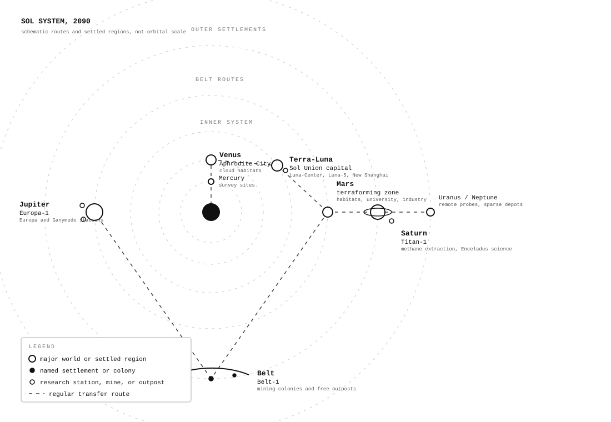
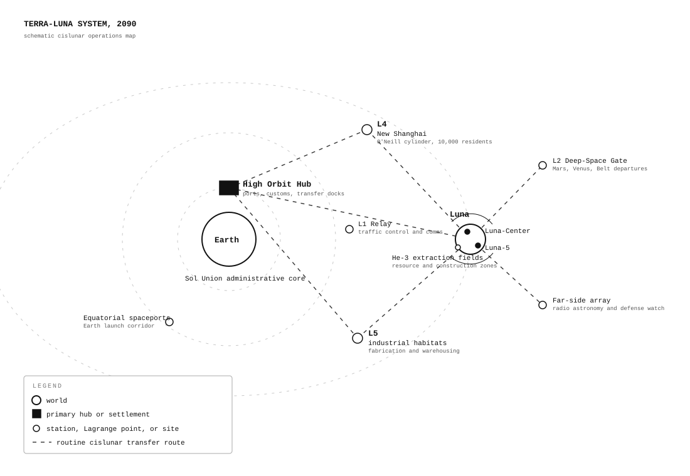
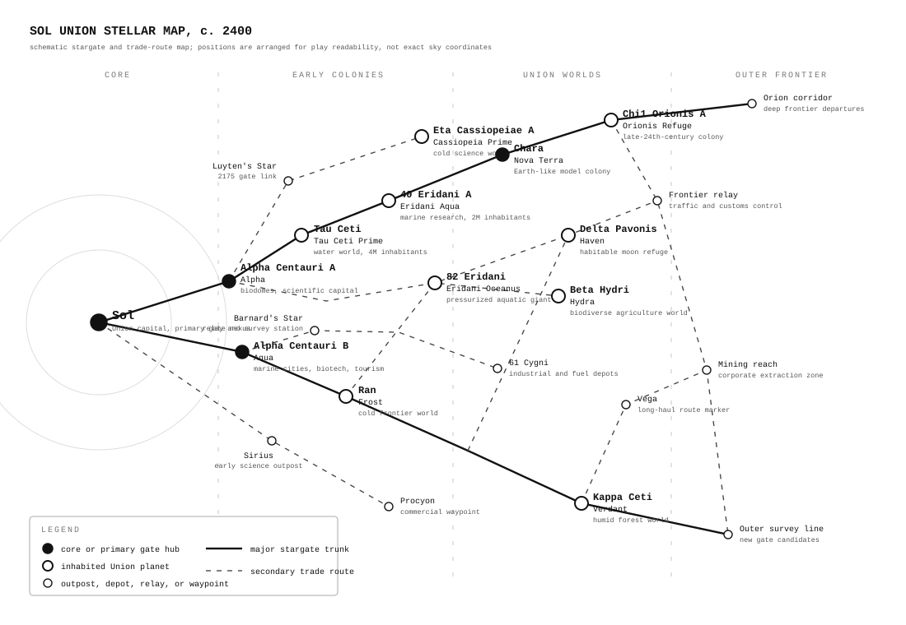
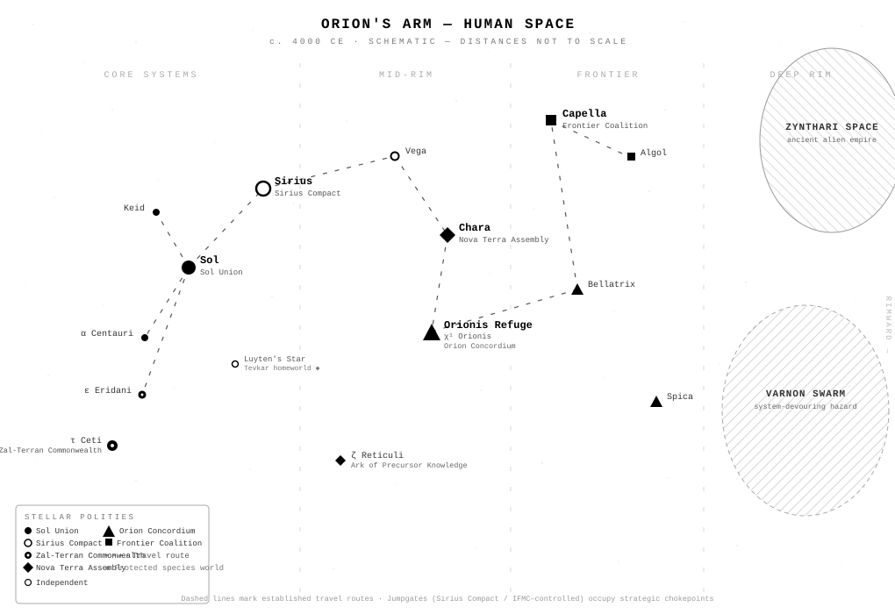

The maps below are schematic play aids for the three eras of **Terra Beyond**. They are designed for orientation at the table rather than exact astrophysical scale.

## Sol: Beyond Earth

### Sol System, 2090

This map presents the Solar System as a set of operational zones: the inner system, Terra-Luna traffic, Mars, the Belt, and the first outer settlements around Jupiter and Saturn. It highlights the places most likely to matter in play: Venus's Aphrodite City, the Terra-Luna core, Mars's terraforming frontier, Belt-1, Europa-1, and Titan-1.

### Terra-Luna System, 2090

This cislunar map zooms in on the economic and political center of the early Sol Union. It shows Earth, Luna, orbital hubs, Lagrange points, New Shanghai, Luna-Center, Luna-5, lunar extraction fields, and routine transfer routes.

## Frontier: Beyond Sol

### Sol Union Stellar Map

This stellar map covers the age of expansion beyond the Solar System. It frames nearby settled space as a web of stars, routes, and frontier systems where trade, gate access, corporate logistics, and colonial autonomy define most conflicts.

## Orion: Beyond the Frontier

### Orion's Arm Human Space

This black-and-white map shows human space in the far-future Orion era. It emphasizes political geography: core systems, mid-rim holdings, frontier regions, deep-rim hazards, interstellar routes, major polities, independent systems, and external threat zones.
